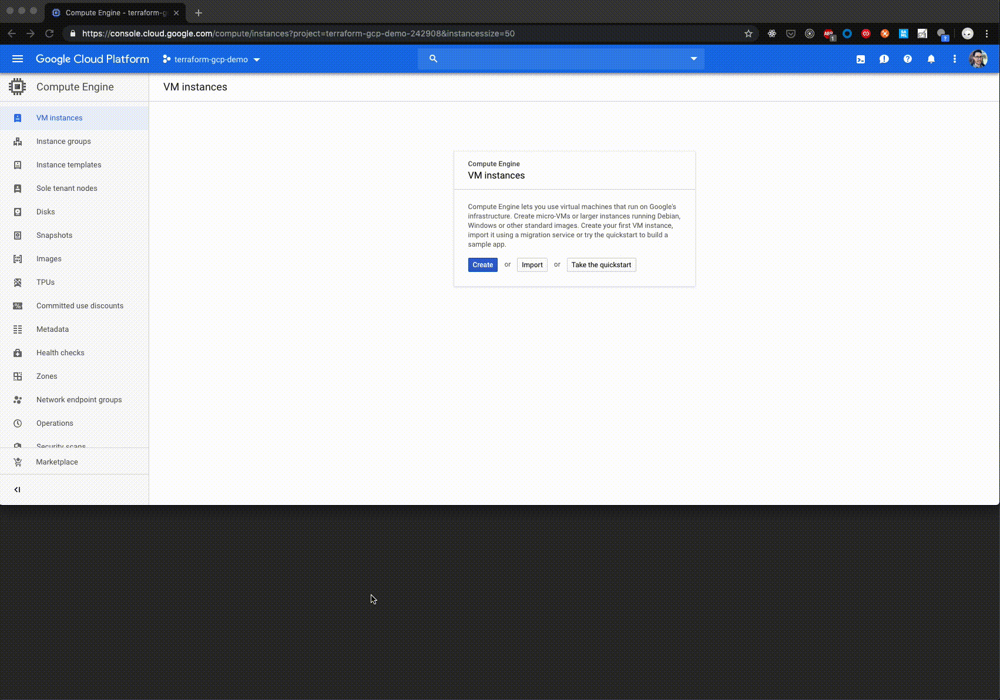

# Terraform GCP Demonstration

Basic end-to-end terraform setup for nginx on GCE.

## Introduction

This repository demonstrates a contrived example of automation that is possible using Terraform on Google Cloud Platform. It aims to capture the simplest steps involved in enabling a basic nginx deployment to be run on GCE via Docker.

In addition to running the application, we also show how we an inject some customised HTML, this could be analogue to loading a static bundle that may take place in a more "real-world" production environment.



## Getting started

### Pre-requisites

To carry out the deployment and running of the demonstration ensure you have the following available:

* Automation tooling - Terraform v0.12, installable by running `brew install terraform on macOS`
* Make - install with `x-code-select --install on macOS`
* `gcloud` CLI - used to initialise our credentials for using Terraform. Install by running `brew install gcloud`
* Create a GCP project following the instructions [here](https://cloud.google.com/resource-manager/docs/creating-managing-projects)

### init

Initialise the project by running the following:

```bash
make init GOOGLE_PROJECT=<your-gcp-project-id>
```

This will bootstrap the terraform environment carrying out the following actions:

* install dependencies (as mentioned above)
* initialise terraform providers and environment
* login to GCP and obtain default-credentials for usage in the terraform stack we're deploying

### deploy

Run the following the deploy the terraform stack:

```bash
make deploy GOOGLE_PROJECT=<your-gcp-project-id>
```

This will carry out a few tasks including the following:

* create custom VPC
* create compute engine instance in custom vpc
* create firewall rules allowing ingress on port 80
* initialise the instance with docker + nginx
* customise the content served by nginx
* enable some basic resource logging of the nginx container
* once complete, it will open up a browser to the assigned public IP
* enable a basic metric logging service via systemd to collect metrics for running containers

### destroy

Once satisfied all is functional, run the following to purge all provisioned resources:

```bash
make destroy GOOGLE_PROJECT=<your-gcp-project-id>
```

### getting help

Contained within this repository is a basic `Makefile` which gives us a number of entrypoints we'll use to simplify the running of the main steps. To view the available entrypoints run the folllowing:

```bash
make help
```

## Future Work

* Deploy a GKE cluster, deploy a nginx service and enable ingress on port 80

* Use Ansible to carry out same end-to-end deployment and comment on differences from a user-experience perspective
